# commit-svg-with-animals

## 概要

`svgfy.py`は GitHub のコミット履歴を取得し、動物がコミットを盗むアニメーションを含む SVG を生成するツールです。

## 出力サンプル

## 仕組み

- GitHub の GraphQL API を使用して過去 365 日間のコミット履歴を取得
- GitHub のコントリビューションカレンダーと同様の視覚的表現を生成
- コミットが多い場所に動物が登場
- CSS/SVG アニメーションで動物がコミットを盗みます．

## 必要条件

- Python 3.x
- 外部ライブラリ: `requests`, `dotenv`
- GitHub パーソナルアクセストークン（名前は Workflow の変数と合わせてください．）

## 使用方法

Workflow を実行すると，`output.svg`が生成され，指定したリポジトリのブランチに Push します．

